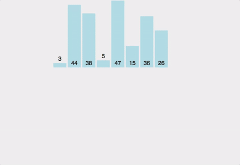

## 합병 정렬 (Merge Sort)

대표적인 nlogn 정렬 알고리즘이다.

합병정렬은 항상 nlogn 의 성능을 내는 알고리즘으로 힙정렬과 같고 최악상황의 퀵(n^2) 보다 안정적이다.

하지만 평균적으로 퀵정렬보다 느린 성능을 보이며 알고리즘 구현에있어 힙정렬보다 메모리를 더 많이먹는다.

일반적인 방법으로 구현했을 때 이 정렬은 **안정 정렬** 에 속하며, 분할 정복 알고리즘의 하나이다.

- 합병 정렬의 과정
    - 리스트의 길이가 0 또는 1이면 이미 정렬된 것으로 본다.
    - 그렇지 않은 경우, 정렬되지 않은 리스트를 절반으로 잘라 비슷한 크기의 두 부분 리스트로 나눈다.
    - 각 부분 리스트를 재귀적으로 합병 정렬을 이용해 정렬한다.
    - 두 부분 리스트를 다시 하나의 정렬된 리스트로 합병한다.

- *퀵소트와의 차이점*

    - 퀵정렬 : 우선 피벗을 통해 정렬(partition) → 영역을 쪼갬(quickSort)

    - 합병정렬 : 영역을 쪼갤 수 있을 만큼 쪼갬(mergeSort) → 정렬(merge)

> 안전 정렬 : 동일한 값에 기존 순서가 유지 (버블, 삽입, 합병)
>
> 불안정 정렬 : 동일한 값에 기존 순서가 유지X (선택,퀵)


## 정렬방식 (오름차순)

- 배열에 27, 10, 12, 20, 25, 13, 15, 22이 저장되어 있다고 가정하고 자료를 오름차순으로 정렬해 보자.

- 2개의 정렬된 리스트를 합병(merge)하는 과정

    1. 2개의 리스트의 값들을 처음부터 하나씩 비교하여 두 개의 리스트의 값 중에서 더 작은 값을 새로운 리스트(sorted)로 옮긴다.

    2. 둘 중에서 하나가 끝날 때까지 이 과정을 되풀이한다.
    3. 만약 둘 중에서 하나의 리스트가 먼저 끝나게 되면 나머지 리스트의 값들을 전부 새로운 리스트(sorted)로 복사한다.
    4. 새로운 리스트(sorted)를 원래의 리스트(list)로 옮긴다.

- 


## [Top-Down 형식] Java 소스코드 (오름차순)

```java
public class Merge_Sort {

  private static int[] sorted;		// 합치는 과정에서 정렬하여 원소를 담을 임시배열

  public static void merge_sort(int[] a) {

    sorted = new int[a.length];
    merge_sort(a, 0, a.length - 1);
    sorted = null;
  }

  // Top-Down 방식 구현
  private static void merge_sort(int[] a, int left, int right) {

    /*
     *  left==right 즉, 부분리스트가 1개의 원소만 갖고있는경우
     *  더이상 쪼갤 수 없으므로 return한다.
     */
    if(left == right) return;

    int mid = (left + right) / 2;	// 절반 위치 

    merge_sort(a, left, mid);		// 절반 중 왼쪽 부분리스트(left ~ mid)
    merge_sort(a, mid + 1, right);	// 절반 중 오른쪽 부분리스트(mid+1 ~ right)

    merge(a, left, mid, right);		// 병합작업

  }

  /**
   * 합칠 부분리스트는 a배열의 left ~ right 까지이다. 
   *
   * @param a		정렬할 배열
   * @param left	배열의 시작점
   * @param mid	배열의 중간점
   * @param right	배열의 끝 점
   */
  private static void merge(int[] a, int left, int mid, int right) {
    int l = left;		// 왼쪽 부분리스트 시작점
    int r = mid + 1;	// 오른쪽 부분리스트의 시작점 
    int idx = left;		// 채워넣을 배열의 인덱스


    while(l <= mid && r <= right) {
      /*
       *  왼쪽 부분리스트 l번째 원소가 오른쪽 부분리스트 r번째 원소보다 작거나 같을 경우
       *  왼쪽의 l번째 원소를 새 배열에 넣고 l과 idx를 1 증가시킨다.
       */
      if(a[l] <= a[r]) {
        sorted[idx] = a[l];
        idx++;
        l++;
      }
      /*
       *  오른쪽 부분리스트 r번째 원소가 왼쪽 부분리스트 l번째 원소보다 작거나 같을 경우
       *  오른쪽의 r번째 원소를 새 배열에 넣고 r과 idx를 1 증가시킨다.
       */
      else {
        sorted[idx] = a[r];
        idx++;
        r++;
      }
    }

    /*
     * 왼쪽 부분리스트가 먼저 모두 새 배열에 채워졌을 경우 (l > mid)
     * = 오른쪽 부분리스트 원소가 아직 남아있을 경우
     * 오른쪽 부분리스트의 나머지 원소들을 새 배열에 채워준다.
     */
    if(l > mid) {
      while(r <= right) {
        sorted[idx] = a[r];
        idx++;
        r++;
      }
    }

    /*
     * 오른쪽 부분리스트가 먼저 모두 새 배열에 채워졌을 경우 (r > right)
     * = 왼쪽 부분리스트 원소가 아직 남아있을 경우
     * 왼쪽 부분리스트의 나머지 원소들을 새 배열에 채워준다.
     */
    else {
      while(l <= mid) {
        sorted[idx] = a[l];
        idx++;
        l++;
      }
    }

    /*
     * 정렬된 새 배열을 기존의 배열에 복사하여 옮겨준다.
     */
    for(int i = left; i <= right; i++) {
      a[i] = sorted[i];
    }
  }
}
```

## [Bottom-up 형식] Java 소스코드 (오름차순)

```java
public class Merge_Sort {

  private static int[] sorted;		// 합치는 과정에서 정렬하여 원소를 담을 임시배열

  public static void merge_sort(int[] a) {

    sorted = new int[a.length];
    merge_sort(a, 0, a.length - 1);
    sorted = null;
  }

  // Bottom-Up 방식 구현
  private static void merge_sort(int[] a, int left, int right) {

    /*
     * 1 - 2 - 4 - 8 - ... 식으로 1부터 서브리스트를 나누는 기준을 두 배씩 늘린다.
     */
    for(int size = 1; size <= right; size += size) {

      /*
       * 두 부분리스트을 순서대로 병합해준다.
       * 예로들어 현재 부분리스트의 크기가 1(size=1)일 때
       * 왼쪽 부분리스트(low ~ mid)와 오른쪽 부분리스트(mid + 1 ~ high)를 생각하면
       * 왼쪽 부분리스트는 low = mid = 0 이고,
       * 오른쪽 부분리스트는 mid + 1부터 low + (2 * size) - 1 = 1 이 된다.
       *
       * 이 때 high가 배열의 인덱스를 넘어갈 수 있으므로 right와 둘 중 작은 값이
       * 병합되도록 해야한다.
       */
      for(int l = 0; l <= right - size; l += (2 * size)) {
        int low = l;
        int mid = l + size - 1;
        int high = Math.min(l + (2 * size) - 1, right);
        merge(a, low, mid, high);		// 병합작업
      }
    }


  }

  /**
   * 합칠 부분리스트는 a배열의 left ~ right 까지이다. 
   *
   * @param a		정렬할 배열
   * @param left	배열의 시작점
   * @param mid	배열의 중간점
   * @param right	배열의 끝 점
   */
  private static void merge(int[] a, int left, int mid, int right) {
    int l = left;		// 왼쪽 부분리스트 시작점
    int r = mid + 1;	// 오른쪽 부분리스트의 시작점 
    int idx = left;		// 채워넣을 배열의 인덱스


    while(l <= mid && r <= right) {
      /*
       *  왼쪽 부분리스트 l번째 원소가 오른쪽 부분리스트 r번째 원소보다 작거나 같을 경우
       *  왼쪽의 l번째 원소를 새 배열에 넣고 l과 idx를 1 증가시킨다.
       */
      if(a[l] <= a[r]) {
        sorted[idx] = a[l];
        idx++;
        l++;
      }
      /*
       *  오른쪽 부분리스트 r번째 원소가 왼쪽 부분리스트 l번째 원소보다 작거나 같을 경우
       *  오른쪽의 r번째 원소를 새 배열에 넣고 r과 idx를 1 증가시킨다.
       */
      else {
        sorted[idx] = a[r];
        idx++;
        r++;
      }
    }

    /*
     * 왼쪽 부분리스트가 먼저 모두 새 배열에 채워졌을 경우 (l > mid)
     * = 오른쪽 부분리스트 원소가 아직 남아있을 경우
     * 오른쪽 부분리스트의 나머지 원소들을 새 배열에 채워준다.
     */
    if(l > mid) {
      while(r <= right) {
        sorted[idx] = a[r];
        idx++;
        r++;
      }
    }

    /*
     * 오른쪽 부분리스트가 먼저 모두 새 배열에 채워졌을 경우 (r > right)
     * = 왼쪽 부분리스트 원소가 아직 남아있을 경우
     * 왼쪽 부분리스트의 나머지 원소들을 새 배열에 채워준다.
     */
    else {
      while(l <= mid) {
        sorted[idx] = a[l];
        idx++;
        l++;
      }
    }

    /*
     * 정렬된 새 배열을 기존의 배열에 복사하여 옮겨준다.
     */
    for(int i = left; i <= right; i++) {
      a[i] = sorted[i];
    }
  }
}
```

## GIF로 이해하는 Merge Sort



## 시간복잡도

- T(n) = nlog₂n(비교) + 2nlog₂n(이동) = 3nlog₂n = O(nlog₂n)


## 공간복잡도

- 두 개의 배열을 병합할 때 병합 결과를 담아 놓을 배열이 추가로 필요합니다. 따라서 공간 복잡도는 `O(N)` 입니다.


## 합병 정렬의 특징

### 장점

- 안정적인 정렬 방법
    - 데이터의 분포에 영향을 덜 받는다. 즉, 입력 데이터가 무엇이든 간에 정렬되는 시간은 동일하다. (O(nlog₂n)로 동일)
    - 만약 레코드를 **연결 리스트(Linked List)** 로 구성하면, 링크 인덱스만 변경되므로 데이터의 이동은 무시할 수 있을 정도로 작아진다.
        - 제자리 정렬(in-place sorting)로 구현할 수 있다.
    - 따라서 크기가 큰 레코드를 정렬할 경우에 연결 리스트를 사용한다면, 합병 정렬은 퀵 정렬을 포함한 다른 어떤 졍렬 방법보다 효율적이다.

### 단점

- 만약 레코드를 배열(Array)로 구성하면, 임시 배열이 필요하다.
    - 제자리 정렬(in-place sorting)이 아니다.
- 레코드들의 크기가 큰 경우에는 이동 횟수가 많으므로 매우 큰 시간적 낭비를 초래한다.


## 참고자료

- https://gmlwjd9405.github.io/2018/05/08/algorithm-merge-sort.html
- https://st-lab.tistory.com/233