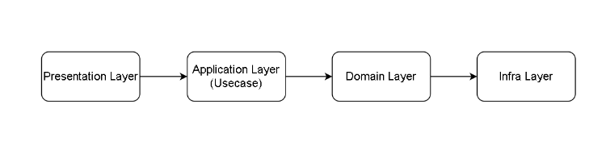

## BackEnd Server Architecture

백엔드 서버 기본 구조

Layer는 총 4개로 구성되어 있으며 각 Layer는 아키텍처를 설명하는 책에 따라 
다른 명칭으로 불리기도 합니다만 (PoEAA는 이 구조를 Persentation Layer, 
Service Layer, Domain Layer, DataSource Layer로 부릅니다.), 전체적으로
4가지 Layer는 거의 흔들리지 않습니다. 서버가 어떤 역할을 수행해야 하는지에 따라,
작성해야 하는 로직이 간단한가, 복잡한가 등의 요인에 의해 각 Layer를 구성하는
요소들이 추가되거나, 합쳐지거나 하는 변형이 일어날 뿐입니다.

> 이후 Layered Architecture 더 개선한 Hexagonal Architecture, Clean Architecture,
> 라는 아키텍처도 등장하지만 기본적인 틀은 일치한다.

## Presentation Layer 1.요청 방식에 따른 Variation

#### 역할과 Variation

- Client의 요청을 변환
- 기본적인 요청 내용 검증
- 수행결과를 Client에 반환
> MVC 패턴에서 Controller의 역할

#### Controller는 아닌 요청 유형

Spring에서 Controller의 기능을 생각해본다면, Web/HTTP에 한정되어있다고
볼수 있지만 Socket이나, Message 등 다른 요청 방식들의 Client도 올수 있다
이 때는 Hexagonal Architecture의 Adapter의 일종으로 생각하는 것이 좋음

### 1. WebSocket

#### Socket이란?

지속적인 양방향 통신을 위해 사용할 수 있습니다. Socket을 이용해야 할때의
특징을 더 정리해보면 다음과 같습니다.

1. 크기가 작은 메세지를 빈번하게 보내야 한다.
2. 연결은 오랫동안 유지되어야 한다.
3. 서버가 주도적으로 데이터를 보낼 수 있어야 한다.
4. caching의 대상이 아니다.

주로 게임, 채팅, 협업도구 등에 사용됨

연결이 지속된다는 측면에서, HTTP keep alive/persistent connection와 
비교되는 경우도 있는데, HTTP(+지속적 연결)와의 결정적인 차이는 socket은 
서버에서도 주도적으로 데이터를 보낼 수 있다는 점입니다. 반면 HTTP
(+지속적 연결)는 연결을 유지할 수 있다고 하더라도, 그 본질은 클라이언트 측에서
시작되는 요청-응답 형식이며, socket과는 달리 주로 웹사이트의 알림에서 
사용되는 경우가 많습니다.

#### Socket 전략 중 하나인 Pub/Sub pattern

Client-Server간 Socket 통신을 할 때에는 주로 Publisher/Subscriber pattern을 사용합니다.(모든 사용사례가 이런 것은 아닙니다.) Pub/Sub pattern에서는 구독자가 관심 있어하는 주제(topic)에 구독을 한 상태에서, 발행자가 주제에 정보를 보내면, 해당 주제를 구독하고 있는 모든 구독자에게 정보가 전송되는 방식입니다.

예를 들어 유저 A가 ‘aa학과 bb학번’ 채팅방을 개설하면 ‘aa’학과 bb학번’ 채팅방이라는 topic이 생성된 것이고, 유저 A는 이 topic을 구독한 셈이 됩니다. 누군가(유저 B)를 이 채팅방에 초대한다는 것은 유저 B 또한 이 주제에 대해 구독하는 것과 같은 의미입니다. 이 때, 유저 A가 채팅방에 메시지를 전송하면, 메시지는 서버로 전달되고, 서버는 이 topic의 구성원에게 메시지를 전체적으로 전송하게 됩니다.

예시가 채팅방이기 때문에 카카오톡과 같은 메시징 앱의 background service에서 소켓이 항상 연결되어 있다고 오해할 수 있는데, 이런 기능은 HTTP를 사용합니다. 즉, 카카오톡을 사용하면서 채팅방을 연 상태에서는 socket 통신일 수 있지만(빈번한 양방향 통신이 요구되므로), 다른 탭(뉴스 등)을 보고 있다던가 잠금 화면일 경우에는 HTTP 통신을 이용하는 방식입니다. push notification에 대해서는 서버로부터 클라이언트로의 일방적인 통신이므로, ‘Presentation Layer의 응답 유형에 따른 Varation’ 포스팅에서 간략히 소개하겠습니다.

#### Spring에서의 Socket 구현

Socket을 이용한 통신의 경우에는 Controller를 이용하는 방식 뿐만 아니라, [특정 주소에 대한 Handler를 등록하는 방식으로도](https://velog.io/@hanblueblue/%EB%B2%88%EC%97%AD-Spring-4-Spring-WebSocket) 수행될 수 있습니다(사실 거의 같은 말이긴 합니다). 여기서 socket 통신까지 설명하기에는 글 하나를 가득 채울 수 있기 때문에 링크를 참조 바랍니다.

https://www.baeldung.com/websockets-spring

https://spring.io/guides/gs/messaging-stomp-websocket/

유의사항은 위 링크들에서 제시하고 있는 예시는 채팅방과 관련된 정보가 memory상에 저장되고 있기 때문에, 실제로 분산 서버 환경에서 사용하려면 redis 등의 저장소가 별도로 필요하다는 점입니다.

### 2. Domain Event (Message Queue)

Domain Event는 주로 도메인 주도 개발과, 마이크로서비스 개발에서 개발 영역의 분리를 위해 사용됩니다.

예를 들어, 고객에 대한 알림을 발송하는 알림 시스템과 주문/주문취소등을 다루는 주문 시스템이 분리되어있다고 가정해보겠습니다.

주문이 일어나거나, 주문이 취소될 때 사용자에게 알림이 전달되어야 한다면, 어떻게 주문 시스템에서 알림 시스템에 발송 요청을 전달할 수 있을까요?

가장 간단하게는 주문 처리가 끝난 후, 알림을 발송하는 메서드를 호출할 수 있습니다. 더 나아간다면 다른 서버에 있는 REST API를 호출할 수도 있겠죠. 이를 흔히 동기 RPI(Remote Procedure Invocation)패턴이라고 부르기도 합니다. 이 방식에는 흔히 REST API나 gRPC같은 방식들이 있습니다.

하지만 이 방식은, 일련의 작업이 수행되는 동안 양 시스템이 실행중이어야 하며, 알림 시스템의 서버에 장애가 있을 경우, 요청이 누락될 수 있다는 단점이 있습니다.

이런 단점이 크게 느껴지는 상황에서는(동기 패턴이 잘못된 방식은 아닙니다. 상황에 따른 선택이 가능합니다.) 비동기 메시징 방식을 고려해볼 수 있습니다.

비동기 메시징 방식에서는 어떤 일이 발생했다(주문이 처리됐다)는 도메인 이벤트를 발행하여, 이벤트의 핸들러가 이 후속 작업을 처리하도록 유도합니다. 특히 Kafka, RabbitMQ와 같은 메시지 브로커들을 사용한다면, 후속 작업을 처리하는 서버에 장애가 있더라도, 장애가 회복되었을 때 후속 작업을 처리하도록 할 수 있습니다.